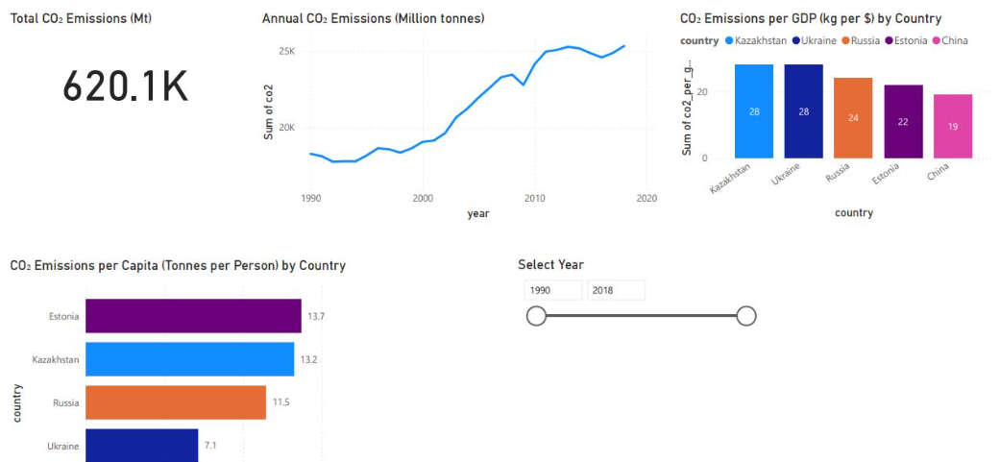

# CO₂ Emissions Analysis: Trends, Intensity, and Per-Capita Insights (1990–2018)

A Power BI dashboard analysing global CO₂ emissions trends from 1990 to 2018, exploring total emissions, per-capita intensity, and emissions relative to GDP across countries.

> **Note:** The original `.pbix` file is no longer available. This repo showcases the dashboard through a screenshot, along with a summary of the approach and key insights.



---

## Project Objective

To analyse global CO₂ emissions patterns over a 28-year period, comparing total emissions, per-capita emissions, and emissions intensity relative to GDP across countries — supporting sustainability and environmental policy insights.

---

## Data Source

Publicly available CO₂ emissions dataset (Kaggle).

---

## Tools & Skills Used

| Stage | Tools |
|---|---|
| Data cleaning & transformation | Power Query |
| Data modelling | Power BI |
| Calculated metrics | DAX (per-capita, per-GDP calculations) |
| Dashboard development | Power BI Desktop |
| Interactivity | Year range slider (1990–2018) |

---

## Dashboard Overview

- **Total CO₂ Emissions:** 620.1K Mt
- **Annual CO₂ Emissions Trend:** Line chart showing a steady rise from 1990, with emissions roughly tripling by the mid-2010s before plateauing near 2018
- **CO₂ Emissions per GDP by Country:** Kazakhstan (35 kg/$), Ukraine (26), Russia (24), Estonia (23), China (18)
- **CO₂ Emissions per Capita by Country:** Estonia (13.7 tonnes/person), Kazakhstan (13.2), Russia (11.6), Ukraine (7.1), China (4.6)
- **Interactive Filter:** Year range slider (1990–2018)

---

## Key Insights

- Global CO₂ emissions in the dataset show a clear upward trend from 1990, nearly tripling by the mid-2010s before levelling off toward 2018
- Kazakhstan has the highest emissions intensity relative to GDP (35 kg/$), suggesting a more carbon-intensive economy relative to its economic output than the other countries shown
- Estonia has the highest per-capita emissions (13.7 tonnes/person) despite not leading on per-GDP intensity — highlighting that per-capita and per-GDP metrics tell different stories and shouldn't be read interchangeably
- China shows the lowest per-capita emissions (4.6 tonnes/person) among the countries compared, despite being a major global emitter in absolute terms — a reflection of its large population diluting the per-person figure

---

## Repo Contents

\```
├── README.md
└── co2-emissions-dashboard.png
\```

---

## About

Independent Power BI project — part of a self-directed portfolio built to strengthen data analytics and dashboard design skills. Completed **July–September 2025**.
